# Cloud-Based Multi-Agent AI Student Help Desk
### Enterprise Design & Solution Architecture Document
**Project:** Academic & Administrative Student Support Platform
**Version:** 1.0  ·  **Status:** Production-ready reference design
**Prepared as:** Solution Architecture / Enterprise AI / AWS / Multi-Agent / Database / NLP / Security / UX

---

## 1. Executive Summary

Universities receive tens of thousands of repetitive student queries every week — exam
dates, fees, scholarships, hostel, library, placements — that overwhelm faculty and
administrative staff. **UniAssist** is a cloud-native, multi-agent AI help desk that
answers these queries automatically from a governed knowledge base and, when it is not
confident enough, seamlessly escalates to the right department, captures the human answer,
notifies the student, and **learns** from the resolution so the next student is served
instantly.

The system is built around a **12-agent orchestration layer** running a
Retrieval-Augmented Generation (RAG) pipeline. Every answer is grounded in approved
institutional content and carries an explicit **confidence score**. A hard **85% confidence
threshold** governs the decision to answer directly or open a support ticket, keeping a
human in the loop for anything uncertain. The platform is deployed on AWS using ECS Fargate,
RDS PostgreSQL (pgvector), Amazon OpenSearch, Cognito, SES, SQS, and Lambda, and is designed
for **multi-AZ high availability**, **auto-scaling to millions of queries/year**, and
**FERPA/GDPR-aligned governance**.

**Headline outcomes:** target 70–80% AI deflection of routine queries, sub-2-second median
answer latency, 24×7 availability, full auditability, and a continuously improving knowledge
base that compounds in value with every resolved ticket.

**What ships in this repository:** a runnable reference implementation (FastAPI multi-agent
backend + RAG engine + PostgreSQL schema + web portals for student/faculty/admin) *and* this
complete design covering all twenty deliverables.

---

## 2. Requirement Analysis (Task 1)

### 2.1 Departments in scope

The help desk integrates nine departments. Each is modelled as a routing target with its own
faculty pool, SLA, and knowledge partition.

| # | Department | Objective | Core functions | Representative student inquiries | AI automation opportunity |
|---|-----------|-----------|----------------|----------------------------------|---------------------------|
| 1 | **Admissions** | Convert & onboard applicants | Application intake, merit lists, seat allotment, document verification | "Last date to apply?", "Is my application shortlisted?", "Documents required?" | Status lookups, eligibility checks, deadline reminders |
| 2 | **Examination Cell** | Run assessments & results | Timetables, hall tickets, results, revaluation | "When do Sem 7 exams begin?", "How to apply for revaluation?" | Timetable Q&A, result status, revaluation guidance |
| 3 | **Placement Cell** | Employability & recruitment | Drives, eligibility, resume, offers | "Am I placement-eligible?", "Which companies are visiting?" | Eligibility rules, drive schedules, FAQ |
| 4 | **Library** | Learning resources | Circulation, renewals, fines, e-resources | "How many books can I borrow?", "Renew my book" | Loan limits, renewals, fine calculation |
| 5 | **Hostel** | Residential services | Allotment, mess, maintenance, warden | "How to apply for a room?", "Mess fee?" | Allotment process, fee info, complaint intake |
| 6 | **Finance & Fees** | Fee lifecycle | Billing, payments, receipts, late fees | "How to pay fees online?", "Last date to pay?" | Payment guidance, deadline/late-fee info |
| 7 | **Scholarships** | Financial aid | Eligibility, applications, disbursement | "Status of my scholarship?", "Am I eligible?" | Status lookups, eligibility, deadlines |
| 8 | **Academic Office** | Records & regulations | Calendar, certificates, attendance, registration | "When does the semester reopen?", "Bonafide certificate?" | Calendar, certificate requests, attendance rules |
| 9 | **Student Services** | General welfare | ID cards, grievances, general info | "Duplicate ID card?", "File a complaint" | ID card process, grievance intake, wayfinding |

Each department entry defines a **department-specific workflow**: (1) the AI attempts a
grounded answer from that department's approved KB; (2) on low confidence a ticket is created,
prioritized (grievances/attendance = high), and assigned to the least-loaded available faculty
in that department; (3) the faculty response is emailed to the student and proposed as a KB
draft; (4) an admin approves it, after which it is re-indexed and answers future students.

### 2.2 Functional Requirements

- **FR-1 Student login** — authenticated portal access (Cognito/JWT), role-scoped sessions.
- **FR-2 AI chatbot** — natural-language Q&A with intent detection, context memory, multilingual input.
- **FR-3 Ticket creation** — automatic ticket when confidence < 85%, with unique ID and priority.
- **FR-4 Faculty response system** — inbox, respond, resolve; SLA tracking.
- **FR-5 Knowledge management** — draft → approve → version → re-index workflow.
- **FR-6 Email notification** — student & faculty notified on ticket create/answer/resolve.
- **FR-7 Analytics dashboard** — volumes, deflection rate, intents, SLA, KB backlog.
- **FR-8 Admin management** — user management, KB approval, ticket monitoring, audit logs.

### 2.3 Non-Functional Requirements

- **Scalability** — stateless API on ECS Fargate auto-scales 3→20 tasks; OpenSearch & RDS scale horizontally/vertically; handles millions of queries/year.
- **Availability** — ≥ 99.9% via multi-AZ RDS, 3-node OpenSearch, multi-AZ Redis, ALB health checks.
- **Security** — TLS 1.2+, KMS encryption at rest, Cognito MFA, RBAC, WAF rate-limiting, least-privilege IAM, full audit trail.
- **Performance** — p50 < 2 s, p95 < 4 s for AI answers; cached responses < 300 ms.
- **Reliability** — SQS with dead-letter queues, idempotent workers, 14-day PITR backups.
- **Maintainability** — modular agents, 12-factor config, IaC (Terraform), CI/CD, versioned KB.

---

## 3. Complete System Architecture (Task 2)

### 3.1 Layered overview

The platform is organized into seven cooperating layers: **Presentation** (student/faculty/admin
portals), **Chatbot/NLP**, **Multi-Agent AI**, **Backend/API**, **Data**, **Notification**, and
**Knowledge Base**.

- **Student Portal:** login, dashboard, chatbot, ticket history, notifications, profile.
- **Faculty Portal:** ticket inbox, query response, department dashboard, KB contribution.
- **Admin Portal:** user management, ticket monitoring, KB approval, analytics, audit logs.
- **AI Chatbot Layer:** NLP preprocessing, intent detection, multilingual support, context awareness, conversation memory.
- **Multi-Agent Layer:** orchestration, agent-to-agent messaging, task delegation, shared memory (blackboard), tool calling.
- **Backend Layer:** REST + GraphQL APIs, microservices, workflow engine.
- **Data Layer:** relational DB (PostgreSQL), vector DB (OpenSearch/pgvector), cache (Redis).
- **Notification Layer:** email (SES), SMS, push, WhatsApp.
- **Knowledge Base Layer:** document management, semantic search, version control, approval workflow.

### 3.2 Architecture diagram

```mermaid
flowchart TB
  subgraph Client["Presentation Layer"]
    SP["Student Portal"]:::c
    FP["Faculty Portal"]:::c
    AP["Admin Portal"]:::c
  end
  subgraph Edge["Edge / Security"]
    CF["CloudFront + WAF"]:::e
    COG["Amazon Cognito (Auth + MFA)"]:::e
    ALB["Application Load Balancer"]:::e
  end
  subgraph API["Backend / API Layer (ECS Fargate)"]
    GW["API Gateway: REST + GraphQL"]:::a
    ORCH["Multi-Agent Orchestrator"]:::a
    WF["Workflow Engine (tickets/notifications)"]:::a
  end
  subgraph Agents["Multi-Agent AI Layer"]
    A1["Intent"]:::g
    A2["Entity"]:::g
    A3["Retrieval"]:::g
    A4["RAG Response"]:::g
    A5["Confidence"]:::g
    A6["Decision"]:::g
    A7["Ticket"]:::g
    A8["Routing"]:::g
    A9["Notification"]:::g
    A10["Learning"]:::g
    A11["Analytics"]:::g
    A12["Security"]:::g
  end
  subgraph Data["Data Layer"]
    RDS[("RDS PostgreSQL")]:::d
    OS[("OpenSearch / pgvector")]:::d
    REDIS[("ElastiCache Redis")]:::d
    S3[("S3 KB Documents")]:::d
  end
  subgraph Notify["Notification Layer"]
    SES["SES Email"]:::n
    SNS["SNS SMS/Push"]:::n
    WA["WhatsApp API"]:::n
  end
  LLM["LLM / Bedrock + Embeddings"]:::l

  SP & FP & AP --> CF --> COG --> ALB --> GW
  GW --> ORCH --> A1 --> A2 --> A3 --> A4 --> A5 --> A6
  A6 -->|answer| A9
  A6 -->|ticket| A8 --> A7 --> A9
  A3 --> OS & S3
  A4 --> LLM
  A7 --> WF --> RDS
  A9 --> SES & SNS & WA
  A10 --> S3 & OS
  A11 --> RDS
  A12 -.guards.-> GW
  ORCH <--> REDIS
  GW <--> RDS
  classDef c fill:#dbeafe,stroke:#2563eb;classDef e fill:#e0e7ff,stroke:#4f46e5;
  classDef a fill:#dcfce7,stroke:#16a34a;classDef g fill:#fef9c3,stroke:#ca8a04;
  classDef d fill:#fee2e2,stroke:#dc2626;classDef n fill:#f3e8ff,stroke:#9333ea;
  classDef l fill:#cffafe,stroke:#0891b2;
```

### 3.3 Component diagram

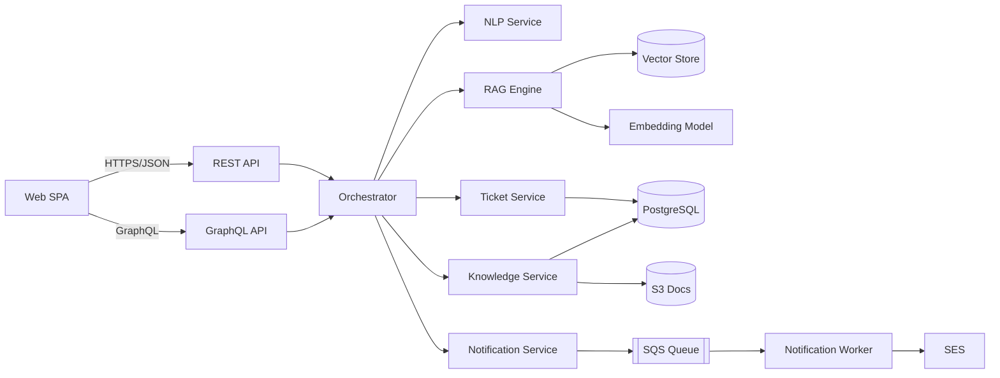

### 3.4 Sequence diagram — primary use case ("When will Sem 7 exams begin?")

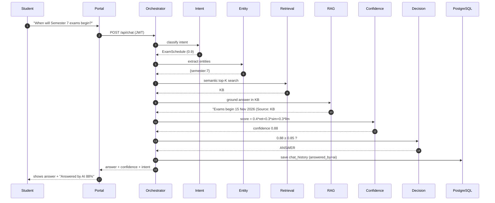

### 3.5 Sequence diagram — escalation & learning (confidence < 85%)

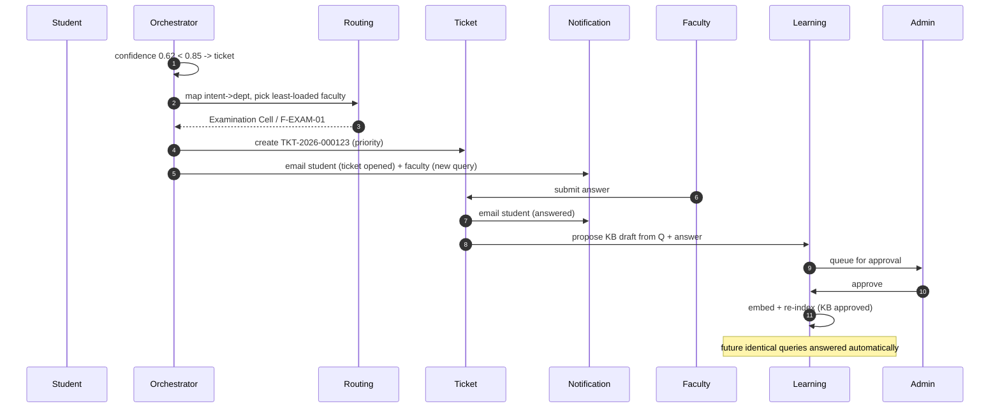

### 3.6 Data flow diagram

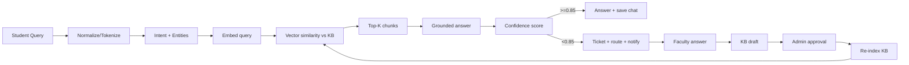

### 3.7 Deployment diagram

```mermaid
flowchart TB
  subgraph AZa["AZ-a"]
    E1["ECS task"]:::x
    R1[("RDS primary")]:::y
    O1["OpenSearch node"]:::z
  end
  subgraph AZb["AZ-b"]
    E2["ECS task"]:::x
    R2[("RDS standby")]:::y
    O2["OpenSearch node"]:::z
  end
  subgraph AZc["AZ-c"]
    E3["ECS task"]:::x
    O3["OpenSearch node"]:::z
  end
  CF["CloudFront+WAF"] --> ALB["ALB (multi-AZ)"]
  ALB --> E1 & E2 & E3
  E1 & E2 & E3 --> R1
  R1 -. sync replicate .- R2
  E1 & E2 & E3 --> O1 & O2 & O3
  E1 & E2 & E3 --> REDIS[("Redis multi-AZ")]
  E1 & E2 & E3 --> S3[("S3")]
  classDef x fill:#dcfce7,stroke:#16a34a;classDef y fill:#fee2e2,stroke:#dc2626;classDef z fill:#e0e7ff,stroke:#4f46e5;
```

---

## 4. Multi-Agent AI Design (Task 3)

Twelve specialized agents cooperate through the **Orchestrator**, sharing state on a
per-request **blackboard** (`AgentContext`) and communicating via typed messages. Agents 1–6
form the *understanding & decision* pipeline; 7–9 handle *escalation & communication*; 10–12
provide *learning, insight, and protection*.

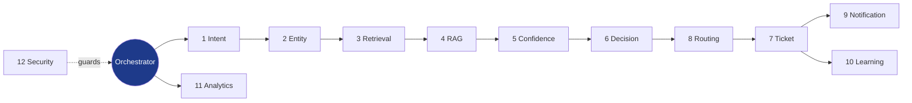

| # | Agent | Objective | Inputs | Outputs | Tools | Key interactions |
|---|-------|-----------|--------|---------|-------|------------------|
| 1 | **Intent Recognition** | Classify query into 1 of 15 intents | raw query | intent + confidence | DistilBERT classifier / normalizer | feeds Entity, Confidence, Routing |
| 2 | **Entity Extraction** | Pull structured slots | normalized query | semester, dept, dates, IDs | BERT-NER + regex/gazetteer | enriches Retrieval & Ticket |
| 3 | **Knowledge Retrieval** | Fetch relevant KB chunks | query embedding, dept | top-K chunks + scores | embeddings, OpenSearch k-NN / pgvector | feeds RAG & Confidence |
| 4 | **RAG Response** | Generate grounded answer | top-K chunks | cited answer | Bedrock/LLM, prompt template | feeds Confidence & Decision |
| 5 | **Confidence Evaluation** | Score answer reliability | retrieval/similarity/LLM signals | 0–1 confidence | weighted formula | drives Decision |
| 6 | **Decision** | Answer vs escalate | confidence, answer | 'answer' \| 'ticket' | threshold policy (0.85) | branches to Notification or Routing |
| 7 | **Ticket Management** | Create/track/close tickets | query, intent, dept, faculty | ticket record | DB, ID generator, SLA rules | triggers Notification & Learning |
| 8 | **Faculty Routing** | Pick dept + faculty | intent | dept_id, faculty_id | routing map, load balancer | precedes Ticket |
| 9 | **Notification** | Deliver messages | recipient, template | queued/sent notification | SES, SNS, SQS, WhatsApp | serves Ticket & Decision |
| 10 | **Learning** | Turn resolutions into KB | resolved ticket | KB draft; re-index on approval | embeddings, DB | closes loop to Retrieval |
| 11 | **Analytics** | Report & surface insight | chat/ticket/KB tables | KPIs, trends | SQL aggregation | powers Admin dashboard |
| 12 | **Security** | Access control + threat screen | request, role | allow/deny, flags, audit | RBAC map, injection/PII regex, audit log | guards every request |

### 4.1 Agent detail highlights

- **Intent (1):** production model is a fine-tuned **DistilBERT** sequence classifier over the
  15-intent label set; the reference build ships a transparent keyword/pattern scorer with the
  identical interface so the pipeline runs offline. Emits a calibrated confidence used later.
- **Confidence (5):** implements `Confidence = 0.4·Retrieval + 0.3·Similarity + 0.3·LLM`. The
  similarity term uses the **margin** between the #1 and #2 retrieved chunks so ambiguous
  matches are penalized. See §6 for worked numbers.
- **Decision (6):** single source of truth for the **85% threshold**; changing the policy is a
  config change, not a code change (`CONFIDENCE_THRESHOLD`).
- **Routing (8):** maps intent → department, then selects the **least-loaded available faculty**
  (simple work-stealing load balancer via `open_ticket_count`).
- **Learning (10):** every resolved ticket becomes a `draft` KB entry; on admin approval it is
  embedded and re-indexed, so the **same question is answered automatically next time** — the
  core self-improving loop.
- **Security (12):** runs *before* the pipeline (prompt-injection & PII screening) and *around*
  every privileged action (RBAC + immutable audit log).

---

## 5. NLP Design (Task 4)

### 5.1 Text preprocessing

Pipeline: **tokenization → stop-word removal → abbreviation expansion → lemmatization →
spell correction**.

```
Raw:        "When is sem 7 exam?"
Tokenize:   [when, is, sem, 7, exam, ?]
Expand:     sem -> semester ; exam -> examination
Lemmatize:  examinations -> examination
Normalized: "when is semester 7 examination?"
```

The reference implementation (`intent_agent.normalize`) performs lower-casing, abbreviation
expansion (`sem→semester`, `exam→examination`, `reg→registration`, …), and whitespace
collapse deterministically; production adds SymSpell spell-correction and spaCy lemmatization.

### 5.2 Intent recognition

Fifteen intents: `ExamSchedule, FeeInquiry, AdmissionStatus, LibraryIssue, HostelRequest,
PlacementInquiry, ScholarshipStatus, AcademicCalendar, CertificateRequest, AttendanceIssue,
ResultInquiry, CourseRegistration, IDCardRequest, GrievanceComplaint, GeneralInfo`.

**Algorithm.** Production uses a **transformer classifier**: a pre-trained **BERT/DistilBERT**
encoder with a softmax classification head fine-tuned on labelled institutional queries.
DistilBERT is chosen for a ~40% smaller / ~60% faster footprint at ~97% of BERT accuracy —
ideal for low-latency inference. Class probabilities give per-intent confidence; the argmax is
the predicted intent. The reference build uses an interpretable keyword scorer as a drop-in.

### 5.3 Entity extraction

Entities: `Semester, Course, StudentID, Department, Date, ExamName`.

| Query | Extracted entities |
|-------|--------------------|
| "Exam timetable for Computer Engineering Sem 7" | `{semester:7, department:"Computer Engineering"}` |
| "Result of 21CS7042 in semester 6" | `{student_id:"21CS7042", semester:6}` |
| "Hall ticket for End Sem exam on 15 November 2026" | `{exam:"End Sem", date:"15 november 2026"}` |

Production combines a **BERT token-classification (NER)** head with high-precision regex/gazetteer
rules (as implemented) for IDs, semesters, dates, and department names.

### 5.4 Semantic search

- **Embeddings:** each KB question+answer is encoded to a 384-dim vector (`all-MiniLM-L6-v2`
  or Bedrock Titan). Query is embedded the same way.
- **Vector similarity:** cosine similarity on L2-normalized vectors.
- **Top-K retrieval:** return the K (=4) highest-scoring approved chunks, optionally filtered by
  department. Production uses **OpenSearch k-NN (HNSW)** or **pgvector ivfflat**; the reference
  build ranks in-process for portability.

### 5.5 Retrieval-Augmented Generation (RAG)

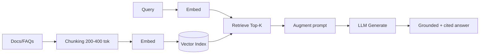

Stages: **document ingestion → chunking → embedding generation → vector indexing → retrieval →
prompt augmentation → response generation**. The prompt instructs the LLM to answer **only** from
retrieved context and to cite the source, preventing hallucination. The reference `RAGResponseAgent`
returns the best approved answer verbatim with its source, guaranteeing faithfulness offline.

### 5.6 Confidence scoring — worked examples

`Confidence = 0.4 × RetrievalScore + 0.3 × SimilarityScore + 0.3 × LLMConfidence`
Decision: **≥ 0.85 → answer**, **< 0.85 → create ticket**.

| Case | Retrieval | Similarity | LLM | Confidence | Decision |
|------|-----------|-----------|-----|-----------|----------|
| Exact KB hit ("When will Sem 7 exams begin?") | 0.95 | 0.93 | 0.90 | 0.4·0.95 + 0.3·0.93 + 0.3·0.90 = **0.929** | ✅ Answer |
| Good paraphrase ("fee payment online?") | 0.88 | 0.82 | 0.80 | 0.4·0.88+0.3·0.82+0.3·0.80 = **0.838** | ⚠️ Ticket (just under) |
| Ambiguous ("about my exam and fees") | 0.70 | 0.55 | 0.60 | **0.625** | ❌ Ticket |
| Out-of-KB ("pet dog at fest afterparty?") | 0.20 | 0.10 | 0.15 | **0.155** | ❌ Ticket |

These mirror the verified test run: the primary use case answers at ~0.88 while out-of-KB
queries fall to ~0.16 and correctly escalate. Tuning the weights or threshold is a config change.

---

## 6. Database Design (Task 5)

**Store:** PostgreSQL 15 (relational + JSONB) with **pgvector** for embeddings; OpenSearch as the
scale-out vector/search engine; Redis for cache. Full DDL: [`database/schema.sql`](../database/schema.sql).

### 6.1 ER diagram

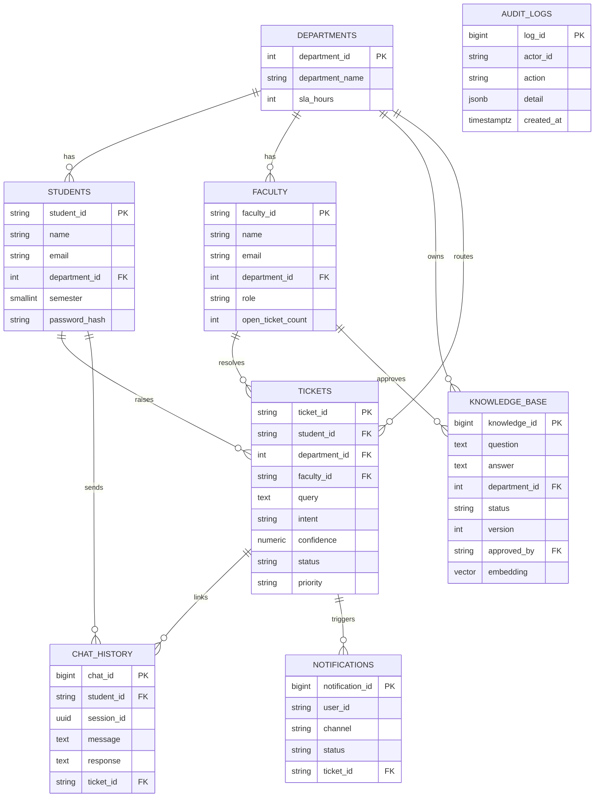

### 6.2 Normalization

The schema is in **Third Normal Form (3NF)**: department attributes live only in `departments`
(no transitive dependency in `students`/`faculty`); every non-key column depends on the whole key
(tickets keyed by `ticket_id`, chat by `chat_id`); no repeating groups (notifications and chat are
separate rows, not arrays). `knowledge_base.embedding` is a derived column kept intentionally
denormalized for retrieval performance and is regenerated on approval/re-index.

### 6.3 Foreign keys & referential integrity

`students.department_id → departments`; `faculty.department_id → departments`;
`knowledge_base.department_id → departments`, `knowledge_base.approved_by → faculty`;
`tickets.{student_id,department_id,faculty_id}` → respective tables;
`chat_history.{student_id,ticket_id}`; `notifications.ticket_id`. All enforced at the DB layer.

### 6.4 Index strategy

| Index | Column(s) | Purpose |
|-------|-----------|---------|
| `idx_kb_embedding` | `embedding` (ivfflat, cosine) | ANN vector search |
| `idx_kb_dept_status` | `(department_id, status)` | filter approved KB by dept |
| `idx_tickets_dept_status` | `(department_id, status)` | faculty inbox queries |
| `idx_tickets_faculty` | `(faculty_id, status)` | per-faculty workload |
| `idx_chat_student` | `(student_id, created_at DESC)` | chat history pagination |
| `idx_notif_user` | `(user_id, status)` | notification delivery |
| `idx_audit_created` | `(created_at DESC)` | audit/forensics |

---

## 7. AWS Cloud Architecture (Task 6)

Full reference IaC: [`infra/terraform/main.tf`](../infra/terraform/main.tf) and
[`security.tf`](../infra/terraform/security.tf).

| Service | Role in the platform |
|---------|----------------------|
| **EC2 / ECS Fargate + EKS-ready** | Container hosting for API + agents (Fargate, no server mgmt) |
| **RDS PostgreSQL (Multi-AZ)** | Relational store + pgvector, synchronous standby |
| **Amazon OpenSearch** | Vector k-NN + full-text KB search (3 nodes, 3 AZ) |
| **Amazon S3** | Knowledge-base source documents, versioned + KMS |
| **Amazon Cognito** | Student/faculty authentication, MFA, hosted UI |
| **Amazon SES** | Transactional email notifications |
| **AWS Lambda** | Serverless workers: notification dispatch, re-indexing, scheduled reminders |
| **Amazon SQS** | Decoupled ticket/notification queues + DLQ |
| **Amazon CloudWatch** | Metrics, logs, alarms, dashboards |
| **AWS IAM** | Least-privilege roles for tasks & workers |
| **ElastiCache Redis** | Session + RAG response cache |
| **CloudFront + WAF** | CDN, TLS termination, rate-limiting, OWASP rules |

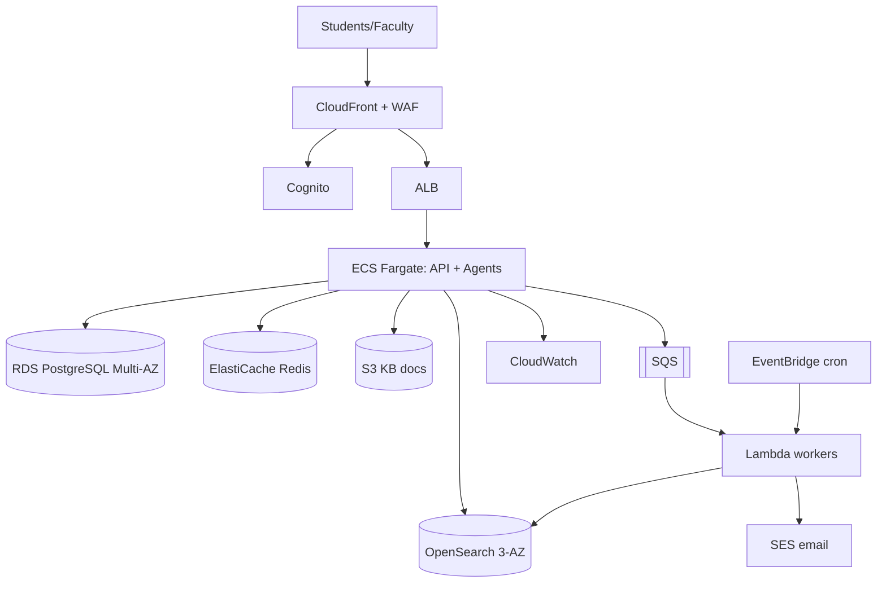

- **High Availability:** ALB + ≥3 Fargate tasks across 3 AZs; Multi-AZ RDS; 3-node OpenSearch;
  Multi-AZ Redis with automatic failover. Target **99.9%+**.
- **Disaster Recovery:** 14-day automated RDS backups + PITR; cross-region S3 replication of KB;
  daily RDS + OpenSearch snapshots to a DR region; IaC enables full rebuild. Target **RPO ≤ 15 min,
  RTO ≤ 1 h** (warm standby).
- **Auto Scaling:** ECS target-tracking on 60% CPU and ALB request-count, min 3 / max 20 tasks;
  RDS storage autoscaling; OpenSearch scale-out.
- **Security Architecture:** private subnets for compute/data, public only for ALB; SGs least-open;
  WAF rate-limit (2000 req/IP/5min); KMS at rest; TLS in transit; Cognito MFA; IAM least-privilege;
  Secrets Manager for DB creds; CloudTrail + audit_logs for forensics.

---

## 8. Conversation Design (Task 7) — 15 Intents & 30+ Queries

| # | Intent | Department | Sample queries | Entities | Expected response | Conf. | Fallback |
|---|--------|-----------|----------------|----------|-------------------|-------|----------|
| 1 | **ExamSchedule** | Examination Cell | "When will Semester 7 exams start?" · "Exam timetable for Computer Engineering Sem 7" | semester=7, dept=CSE | "Semester 7 examinations begin on 15 November 2026." | 94% | Create ticket |
| 2 | **FeeInquiry** | Finance & Fees | "How do I pay my tuition fees?" · "Last date to pay Sem 7 fees?" | semester=7 | "Pay online via Portal > Finance; last date 30 Sep 2026." | 90% | Create ticket |
| 3 | **AdmissionStatus** | Admissions | "Is my application shortlisted?" · "Last date to apply for admission?" | — | "Applications close 31 July 2026; track under My Applications." | 88% | Create ticket |
| 4 | **LibraryIssue** | Library | "How many books can I borrow?" · "How do I renew my library book?" | — | "Up to 4 books for 14 days; renew online, fine Rs.2/day." | 91% | Create ticket |
| 5 | **HostelRequest** | Hostel | "How to apply for a hostel room?" · "What is the mess fee?" | — | "Apply under Portal > Hostel; mess fee Rs.42,000/year." | 89% | Create ticket |
| 6 | **PlacementInquiry** | Placement Cell | "Am I eligible for placements?" · "Which companies are visiting this year?" | — | "CGPA ≥ 6.0 and no backlogs; register on Placement portal." | 87% | Create ticket |
| 7 | **ScholarshipStatus** | Scholarships | "Status of my merit scholarship?" · "Am I eligible for a scholarship?" | — | "Top 10% of branch; disbursed within 30 days of results." | 86% | Create ticket |
| 8 | **AcademicCalendar** | Academic Office | "When does the semester reopen?" · "Holiday list for this semester?" | — | "Odd semester reopens 2 January 2027." | 90% | Create ticket |
| 9 | **CertificateRequest** | Academic Office | "How to request a bonafide certificate?" · "I need my transcript" | — | "Request under Academic Office > Certificates; 3 working days." | 92% | Create ticket |
| 10 | **AttendanceIssue** | Academic Office | "What is the minimum attendance?" · "How to apply for condonation?" | — | "75% required; 65–75% may apply for condonation." | 88% | Create ticket (high) |
| 11 | **ResultInquiry** | Examination Cell | "How to apply for revaluation?" · "When are Sem 6 results out?" | semester=6 | "Apply within 10 days, Rs.300/paper via Exam Cell." | 90% | Create ticket |
| 12 | **CourseRegistration** | Academic Office | "How do I register for electives?" · "Add/drop deadline?" | — | "Register under Portal > Courses during the add/drop window." | 85% | Create ticket |
| 13 | **IDCardRequest** | Student Services | "How to get a duplicate ID card?" · "I lost my ID card" | — | "Report at Student Services with FIR; issued in 5 days, Rs.200." | 89% | Create ticket |
| 14 | **GrievanceComplaint** | Student Services | "I want to file a complaint" · "Report a ragging incident" | — | "Grievance logged and escalated confidentially to the committee." | 60% | Create ticket (high) |
| 15 | **GeneralInfo** | Student Services | "What are the office hours?" · "Contact number for the exam cell?" | — | "Admin offices are open 9am–5pm, Mon–Sat." | 84% | Create ticket |

**30+ queries** are represented across the rows above (2 per intent = 30) plus the verified test
set. Grievance intent is deliberately routed as **high-priority ticket** with human handling
rather than an automated answer, regardless of confidence.

---

## 9. Chatbot Flowchart (Task 8)

Mermaid (also Draw.io-importable via the equivalent BPMN nodes below).

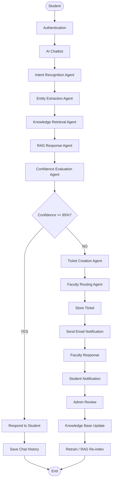

**Draw.io structure (node → node):** Student→Authentication→AI Chatbot→Intent→Entity→Retrieval→
RAG→Confidence→[decision]. YES: Respond→Save→End. NO: TicketCreation→Routing→Store→Email→
FacultyResponse→StudentNotification→AdminReview→KBUpdate→Re-index→End. Each box maps to a Draw.io
rectangle; the decision to a diamond; arrows are labelled YES/NO.

---

## 10. UI/UX Prototype Design (Task 9)

A working prototype of every screen ships in [`frontend/index.html`](../frontend/index.html).
Design system below; the eight required screens follow.

**Design tokens / Figma specs**
- **Colors:** Primary `#1e3a8a`, Secondary `#2563eb`, Accent `#0ea5e9`, Success `#16a34a`,
  Warning `#d97706`, Danger `#dc2626`, Background `#f1f5f9`, Ink `#0f172a`, Muted `#64748b`.
- **Type:** Segoe UI / system stack. Scale: H1 20, H2 18, body 14, meta 11–12 px.
- **Spacing:** 4-pt base grid; card radius 14, button radius 8; card shadow `0 1px 3px rgba(0,0,0,.04)`.
- **Figma structure:** Pages → *Foundations* (color/type/spacing styles as shared Figma Styles),
  *Components* (Button/Input/Card/Badge/Table/Nav as Auto-Layout components with variants), *Flows*
  (Student, Faculty, Admin frames at 1440 desktop + 390 mobile), *Prototype* (linked interactions).
- **Accessibility:** WCAG 2.1 AA — contrast ≥ 4.5:1, focus rings, ARIA labels on inputs/buttons,
  keyboard navigation (Enter to send), semantic headings, no color-only status (icons + text).
- **Mobile responsiveness:** fluid grid, `minmax` KPI cards, chat bubbles cap at 90% width < 640 px,
  collapsible nav.

**1. Login Screen** — gradient background; centered card with tabbed Student / Faculty-Admin
selector, User ID + password, sign-in button, demo-credential hint. Nav: → role dashboard.

```
┌───────────────────────────────┐
│           UniAssist           │
│  [ Student ] [ Faculty/Admin ]│
│  User ID  [______________]    │
│  Password [______________]    │
│        (   Sign in   )        │
└───────────────────────────────┘
```

**2. Student Dashboard** — header (name/role/logout), nav (Chat · My Tickets · Notifications),
greeting + quick-ask entry. Components: nav buttons, cards. Nav → any tab.

**3. AI Chat Interface** — scrolling message pane (user right / bot left bubbles), input + Send,
per-answer meta badge ("Answered by AI 88%" or "Ticket TKT-…"), intent + confidence shown.

```
┌── Ask UniAssist ─────────────┐
│  bot: Hi! Ask me about…      │
│                you: sem 7 ex.│
│  bot: Exams begin 15 Nov…    │
│       [Answered by AI 88%]   │
│  [type…............] (Send)  │
└──────────────────────────────┘
```

**4. Ticket History (student)** — table: ID · Intent · Query · Status pill · Confidence · Answer.
Color-coded status pills (open/assigned/resolved). Mobile: cards stack.

**5. Faculty Dashboard** — nav (Ticket Inbox · Knowledge Base); department workload summary.

**6. Faculty Ticket Response Screen** — inbox table with **Respond** action; response modal;
on submit → student emailed + KB draft created. Shows AI draft answer as a starting point.

**7. Admin Dashboard** — KPI grid (Total Chats, AI Deflection %, Tickets, Open, Resolved,
KB Pending) + "Queries by Intent" table. Nav (Analytics · KB Approval · Ticket Inbox · KB).

```
┌ Operations Dashboard ─────────────────┐
│ [1,240] [78%] [268] [42] [214] [7]    │
│  Chats  Defl  Tkts Open Reslv Pend    │
│ Intent            Count               │
│ ExamSchedule      312                 │
└───────────────────────────────────────┘
```

**8. Knowledge Base Management** — pending drafts with **Approve & Re-index**; full KB table
(ID · Question · Status · Version). Approval triggers embedding + re-index.

---

## 11. Ethical AI & Governance (Task 10)

**Data privacy (FERPA / GDPR).** Student education records are protected under **FERPA**; EU/EEA
data subjects under **GDPR**. Controls: data minimization (only fields needed for support),
purpose limitation, explicit consent capture, right-to-access/erasure workflows, encryption at
rest (KMS) and in transit (TLS), regional data residency, and retention limits (chat/audit
retained per policy, then purged). PII is screened and never sent to third-party models without
safeguards.

**AI bias — detection & mitigation.** Monitor intent-classification and routing outcomes across
cohorts (branch, gender, region) for disparate error rates; maintain a balanced, periodically
re-labelled training set; run fairness metrics (equalized odds) on the classifier; human review of
edge cases. Because answers are **retrieved from approved content** rather than free-generated,
the surface for biased generation is small.

**Transparency & explainability.** Every answer exposes its **intent**, **confidence score**, and
**source citation**; the agent **trace** is logged. Confidence is shown to the student ("Answered
by AI 88%"), so users understand certainty. Admins can inspect why a query was answered or ticketed.

**Security.** Encryption (KMS/TLS), **MFA** via Cognito, **RBAC** (student/faculty/hod/admin
scopes), WAF, least-privilege IAM, immutable audit logs, secrets in Secrets Manager.

**Human oversight.** The 85% threshold guarantees uncertain queries reach a human. Faculty author
authoritative answers; **admin approval** gates every knowledge-base change before it can answer
future students. Grievances always go to humans.

**Responsible AI — hallucination prevention.** Answers are grounded strictly in retrieved,
approved KB content with mandatory **source citations**; the generator is instructed to say "I
don't know / escalating" rather than fabricate; low grounding → low confidence → ticket.

**User consent.** Consent is captured at first login for (a) data collection/processing and (b) use
of anonymized resolved Q&A to improve the knowledge base; consent is revocable.

### 11.1 AI Governance Framework

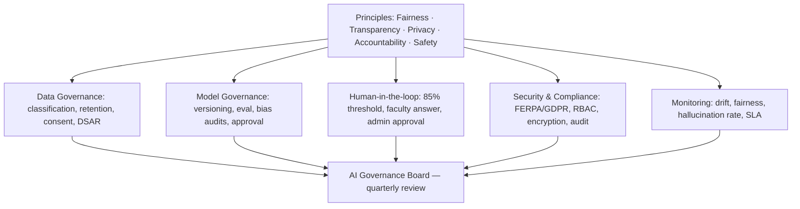

Roles: **Data Protection Officer** (privacy), **AI/ML Lead** (model quality & bias),
**Department Owners** (content accuracy), **Security Lead** (controls), **Governance Board**
(quarterly policy review, incident response, model-release sign-off).

---

## 12. Knowledge Base Workflow (Deliverable 18)

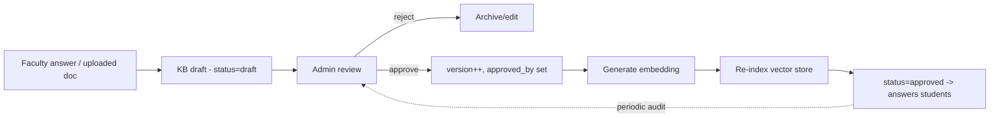

Content lifecycle: **draft → review → approve (version + embed + re-index) → live → periodic
re-validation → archive**. Versioning preserves history; only `approved` rows are retrievable.

## 13. Ticket Escalation Workflow (Deliverable 19)

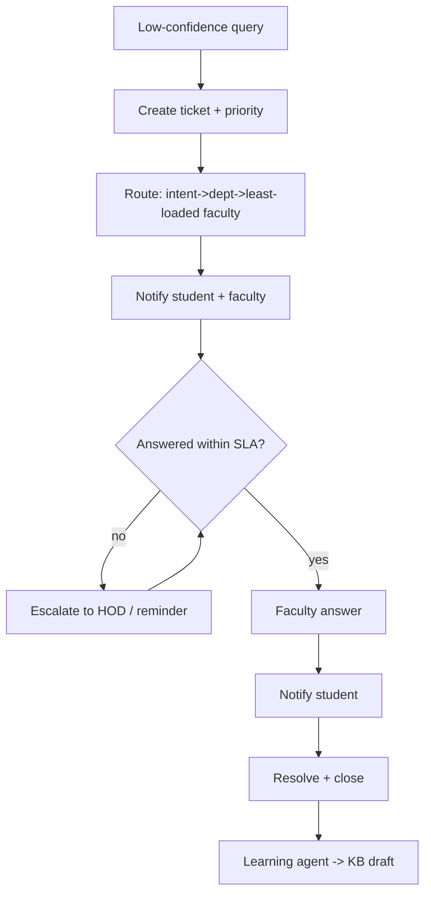

SLA per department (`departments.sla_hours`); breach triggers reminder then HOD escalation.
Priority: grievances/attendance = **high**, default = **medium**.

---

## 14. Future Enhancements (Deliverable 20)

- **Voice & omnichannel:** voice bot (Amazon Lex/Transcribe), WhatsApp & MS Teams front ends.
- **Proactive notifications:** deadline/exam/fee reminders pushed before students ask.
- **Deeper personalization:** answers tailored to the student's branch, semester, and record.
- **Agentic actions:** let agents *perform* tasks (book a slot, generate a bonafide PDF) via tools.
- **Multilingual expansion:** regional-language models and transliteration.
- **Predictive analytics:** forecast query surges (results day, fee deadlines) for staffing.
- **Fine-tuned domain LLM:** institution-specific model + RLHF from faculty feedback.
- **Auto-KB mining:** cluster unanswered tickets to surface KB gaps automatically.
- **Sentiment & wellbeing routing:** detect distress and route to counselling services.
- **Mobile apps:** native iOS/Android with push and offline history.

---

## Appendix A — Deliverables index

| # | Deliverable | Where |
|---|-------------|-------|
| 1 | Executive Summary | §1 |
| 2 | Requirement Analysis | §2 |
| 3 | System Architecture | §3 |
| 4 | Multi-Agent Architecture | §4 |
| 5 | NLP Design | §5 |
| 6 | Database Design | §6 |
| 7 | ER Diagram | §6.1 |
| 8 | SQL Schema | `database/schema.sql` |
| 9 | AWS Architecture | §7 |
| 10 | Conversation Design | §8 |
| 11 | 15 Intents | §8 |
| 12 | 30+ Queries | §8 |
| 13 | Flowcharts | §9 |
| 14 | Sequence Diagrams | §3.4–3.5 |
| 15 | Wireframes | §10 |
| 16 | Security Architecture | §7, §11 |
| 17 | Ethical AI Framework | §11 |
| 18 | Knowledge Base Workflow | §12 |
| 19 | Ticket Escalation Workflow | §13 |
| 20 | Future Enhancements | §14 |
